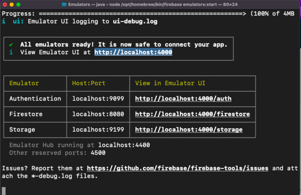
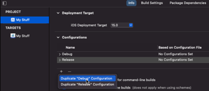
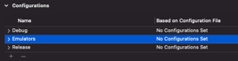
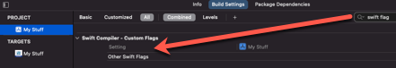
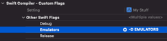
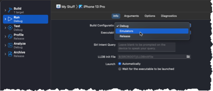

# Installing Firebase Emulator on M1 Mac

You can watch a complete video on this topic here:

<a href="http://www.youtube.com/watch?feature=player_embedded&v=EjrIaQNdniE" target="_blank"></a>

These instructions are for installing the Firebase Emulators on a Macintosh computer.

Instructions are based on the installation of on a Macintosh M1 based computer running Monterey.

If you choose to use the sample project used in this repository, you are going to have to do a few things.

1. Change the Bundle ID to match your own organization name
2. Create a Firebase Project in the Firebase console using the Updated Bundle ID
3. Generate the GoogleService-Info.plist and add it to the Xcode Project
4. On the Firebase Console, add an iOS app and add:
   * Authentication with Email/Password
   * Firestore
   * Storage

Next, you need to install the emulators, but first you will need to install Node and node package manager.

The easist way to do this is by using Homebrew

## Install Homebrew

If Homebrew is not yet installed on your computer, go to https://brew.sh for instructions

Just copy the terminal command in from the homebrew main page then open the Terminal application on your Mac and paste it in then press <Enter>

`````swift
/bin/bash -c "$(curl -fsSL https://raw.githubusercontent.com/Homebrew/install/HEAD/install.sh)"
`````

You should now add Homebrew to your PATH and you can do that by copying the two lines of code that is displayed on the console and press <Enter> each time. The code reflects your account so make sure you copy it from the console

`````swift
echo 'eval "$(/opt/homebrew/bin/brew shellenv)"' >> /Users/administrator/.zprofile
eval "$(/opt/homebrew/bin/brew shellenv)"
`````

You can now check for the version of brew installed with the following:

`````swift
brew -v
`````

## Install Nodejs

Next, you can use brew to install NodeJS and you can do this using the following terminal command

`````swift
brew install node
`````

Once the installation has completed, you can check out installed versions of node and node package manager by issuing these commands.

`````swift
node -v
npm -v
`````

## Install firebase emulators suite

You now have everything you need to install firebase tools which gives us the emulator suite.

### Install Firebase tools

To install Firebase tools, use this command.

`````swift
npm install -g firebase-tools
`````

#### Check Firebase tools version

You can check the current version of firebase tools installed by issuing this command:

`````swift
firebase --version
`````

### Test a login

In order to access your Firebase projects, you need to be logged in as that user.  So to do that, enter:

`````swift
firebase login
`````

You just need to step through the prompts to complete the login process.  A web browser will open for you to authenticate.

If all goes well, you will get a **Success** notification in the console that you are logged in.

## Testing

1. You next need to create a project folder on your computer that will host the configuration files.

2. CD to that directory in terminal

3. Issue the firebase init command

`````swift
firebase init emulators
`````

4. Use the arrow keys to move up and down in the terminal window and select the line "Use an existing project" and hit <Enter> 
5. Arrow down to select the project that you want to access and press <Enter>
6. You will next be asked which emulators you want to set up.  Use the arrow keys to move up and down and press the <space bar> to select the emulator.  Once they are selected, hit <Enter>

`````swift
First, let's associate this project directory with a Firebase project.
You can create multiple project aliases by running firebase use --add, 
but for now we'll just set up a default project.

? Please select an option: Use an existing project

? Select a default Firebase project for this directory: sample-firebase-project-368ac (Sample Firebase Project)

i  Using project sample-firebase-project-368ac (Sample Firebase Project)

=== Emulators Setup
? Which Firebase emulators do you want to set up? Press Space to select emulator
s, then Enter to confirm your choices. 
 ◉ Authentication Emulator
 ◯ Functions Emulator
 ◉ Firestore Emulator
 ◯ Database Emulator
 ◯ Hosting Emulator
 ◯ Pub/Sub Emulator
❯◉ Storage Emulator

`````

7. Accept all of the defaults and make sure you enable and download the emulators
4. Next you need to Initialize all of the emulators except for the Authentication emulator.


`````swift
firebase init storage
firebase init firestore
`````

When you do this, you will be asked if you want to download the corresponding rules for your emulator.  Make sure you confirm this.

In the case of firestore, I also have some indexes so make sure you download them too.These files are stored in your configuration folder.

### Start the emulators

You are now able to start your emulators with the start command

`````swift
firebase emulators:start
`````
If you do not see the console display the ports and a notice that the emulators are ready for use like you see below, it is likely that JAVA is not installed on your computer.  I found this on my M1 Mac running Monterey.

## Install Java on M1 Mac

To have the Firebase Emulator suite run properly on your Mac, you will need to install Java.

If you are on a Intel based Mac, you can go to the Java site:

`````swift
https://www.java.com/en/download/
`````

The M1 mac is an ARM 64-biit chip however.  For this, you can go to the **Azul.com** website to download the correct installer.

For an M1 Mac it is the ARM 64-bit version so download the dmg file.

Once it has been downloaded you can execute the package to have it installed.

`````swift
https://www.azul.com/downloads/?package=jdk#download-openjdk
`````

After a successful install, you should then be able to execute the `firebase emulators:start` command to be presented with the successful startup display in the console.



#### View the Emulators

You can open the emulator console in your browser using the url provided.

`````swift
http://localhost.com:4000
`````

You will notice that there is no content yet.  The only thing you have are the rules provided by your project and the plist in your project will access the emulators instead, as long as we tell it to do so.

## Storage Rules Issue

I have done a lot of testing, and I have found that the rules and indexes for firestore work as designed, but in the version that I have installed, the rules for storage cause a problem when trying to upload an item to the storage bucket.  It can read items, but when I attempt to store, the emulators crash.

The solution I discovered for now until these are fixed is to remove any conditions you have for reading and writing.  Since we are working locally on an emulator, you are safe as no live data can be harmed.

When you  update the rules, there is no need to restart the emulators.  You can see that the console will recognize that the changes have been made.

## Your Project

### Custom configuration

To easily switch between the emulator suite and the production server, you can create a new configuration for the default scheme. 

If you select your project (not a target) you can see the two configurations are there on the **Info** tab.

If you tap the **+** button, you can choose to **Duplication "Debug" Configuration** so let's do that, and we can call it something like **Emulators**






### Custom Flags

With the project still selected, switch to **Build Settings** and search for **swift flag**



You should now see **Swift Compiler - Custom Flags**

If you select the **Other Swift Flags** and expand it, you will see the 3 different configurations.,

Select the **Emulators** configuration and in the space to the right, you, enter your own flag.

A custom flag starts with `-D`and then is followed by your own flag name.  I suggest EMULATORS and use all caps




#### Update Xcode

If you are using Xcode 12 or higher, there is no AppDelegate so you are likely initializing FirebaseApp in the file marked with @Main

This is done in an  initializer (or AppDelegate application(:didFinishLaunchingWithOptions))

What I suggest you do is create an if elseif clause that will print to the console to indicate which Firestore you are using and in the EMULATORS section you can add the required calls for each of the three emulators.  This code is found in the Firestore documentation and what it does is specify the location and ports for the emulators.

`````swift
    init() {
        FirebaseApp.configure()
#if EMULATORS
        print(
        """
        ********************************
        Testing on Emulators
        ********************************
        """
        )
        Auth.auth().useEmulator(withHost:"localhost", port:9099)
        Storage.storage().useEmulator(withHost:"localhost", port:9199)
        let settings = Firestore.firestore().settings
        settings.host = "localhost:8080"
        settings.isPersistenceEnabled = false
        settings.isSSLEnabled = false
        Firestore.firestore().settings = settings
#elseif DEBUG
        print(
        """
        ********************************
        Testing on Live Server
        ********************************
        """
        )
#endif
`````

### Run Your App

When you run your application, you can choose which configuration you want to use.  The default is DEBUG, but you can choose your custom configuration. 

 You can do this by choosing Edit Scheme... from the Product > Scheme menu.

When you select this option, you can see that if you select **Run** on the left and select the **Info** tab, there are all of your configurations. You can choose your custom one.



When it runs, you should now see

`````swift
********************************
Testing on Emulators
********************************
`````

From now on, until you cbange your configuration, you will be working on the emulators.
